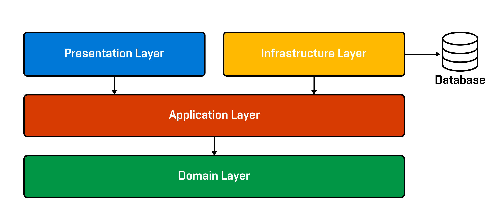

# Airbnb Clone App

This .NET 7 project aims to develop an application similar to Airbnb, utilizing a [Clean Architecture principles](https://learn.microsoft.com/en-us/dotnet/architecture/modern-web-apps-azure/common-web-application-architectures#clean-architecture) and integrating with a MySQL database.

The main objective of the project is to create a robust and scalable web application that enables users to search for, book, and manage accommodations, similar to how Airbnb works. The application will provide a platform for property owners to list their spaces and for users to discover and book these accommodations for their desired dates.

## Architecture
Entire application is divided into four layers:


## Entity-relationship model
⚠️ work in progress

## API documentation

### Authentication

#### Register
```js
POST /auth/register
```

```json
{
    "firstName": "John",
    "lastName": "Doe",
    "email": "johndoe@example.com",
    "password": "password"
}
```

#### Login
```js
POST /auth/login
```

```json
{
    "email": "johndoe@example.com",
    "password": "password"
}
```

#### <em><strong>more methods to be added as development progresses</strong></em>
